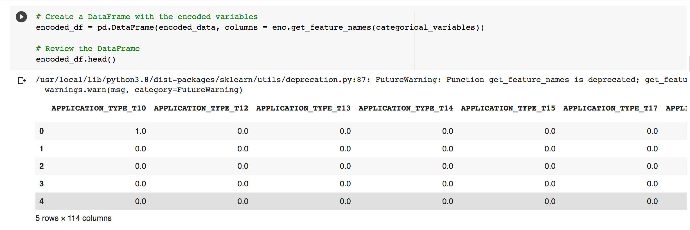

### IMPORTANT NOTE ##

I was unable to successfully execute the code on "Jupyter notebook" on my Mac. So, used Google Colab to complete the assignment. 

## Dev

I use Jupyter notebook to write the Python code, this code is built in Jupyter notebook on a Mac PC. 
The process must be pretty much same when executing from GitBash on WindowsPC except that you will need Visual Studio Code to install required extensions/moduled.
To ensure, a suitable environment is existing to execute this code, you will need to have python3 and pip3 installed already. 
Python versions older than 3 might not function effeciently. The Python version used to write this code is 3.10.6, any verison of Python3 should work.

## Dependencies

Apart from python3 and pip3, you will need to have jupyter, anaconda and matplotlib installed at the operating system level.
All the dependent librariries required to successfully use pandas and sklearn modules must be installed, the code is heavily dependent on pandas, hvplot,pathlib and sklearn modules.

Following modules must be already installed before running the code and conda environment must be activated as well. To execute the code, Jupyter notebook must be used. 

Below commands are Mac compatible.

pip3 install conda
pip3 install anaconda3
pip3 install scikit-learn
conda install tensorflow

Since the code performs predictive analysis on imbalanced data, below module needs to be installed

python3 -m pip install -U imbalanced-learn

Before running the code, conda environment must be created and activated.

conda create -n cenv python=3.10.6
conda activate cenv

## What does code perform ?

### Prepare the Data for Use on a Neural Network Model

Read the applicants_data.csv file into a Pandas DataFrame. Review the DataFrame, looking for categorical variables that will need to be encoded, as well as columns that could eventually define your features and target variables.

Encode the dataset’s categorical variables using OneHotEncoder, and then place the encoded variables into a new DataFrame.

OneHotEncoder

	
Added the original DataFrame’s numerical variables to the DataFrame containing the encoded variables.

Using the preprocessed data, created the features (X) and target (y) datasets. The target dataset should be defined by the preprocessed DataFrame column “IS_SUCCESSFUL”. The remaining columns should define the features dataset.

** y data frame **

** X data frame **

Split the features and target sets into training and testing datasets.

Use scikit-learn's StandardScaler to scale the features data.

### Compile and Evaluate a Binary Classification Model Using a Neural Network

To do so, complete the following steps:

Created a deep neural network by assigning the number of input features, the number of layers, and the number of neurons on each layer using Tensorflow’s Keras.

Number of input features is 116 always which is essentially the number of columns in X data frame..

Number of neurons for Ouput layer is = number_input_features * 2/3 or it can be approximately half of number of features as well...

Number of Neurons for first hidden layer is = (number_input_features + number_output_neurons) // 2

Number of Neurons for second hidden layer is = layer1 + number_output_neurons) // 2+

Compiled and fit the model using the binary_crossentropy loss function, the adam optimizer, and the accuracy evaluation metric.

+
Evaluated the model using the test data to determine the model’s loss and accuracy.

Saved and exported the model to an HDF5 file, and name the file AlphabetSoup.h5.

### Optimize the Neural Network Model

Defined at least three new deep neural network models (the original plus 2 optimization attempts). With each, try to improve on your first model’s predictive accuracy.+

Added 3 hidden layers.

Use different activation functions for the hidden layers. Displayed the accuracy scores achieved by each model, and compare the results.

** Accuracy Score for Model **

** Accuracy Score for Model 1 **

** Accuracy Score for Model 2 **

Save each of your models as an HDF5 file.

## Pre-requisites

Ensure all the below csv files are existing on the OS from where you are executing the code. You will need to run "Jupyter notebook" from the same directory (Module10-HW) where all the files exist. Below is the list of files which need to exist for the successful execution of the code.

lending_data.csv
report-template.md
credit_risk_resampling.ipynb
README.md

Git must be installed. If using Windows GitBash must be installed.

To execute the code from Windows - you will need Visual Studio Code installed as well to look at the code.

The file 'crypto_investments.ipynb' is the file to be opened from the 'Jupyter notebook' interface ONLY.

## Execution process

Clone the directory which contains all the .csv files and the .ipynb file to your system using the following commands

git clone https://github.com/venbn/Module10-HW.git

Once the clone completes.. 

Go to the directory "Module10-HW"

cd Module10-HW

Execute 'Jupyter notebook' command

In the Jupyter notebook interface, open the file 'crypto_investments.ipynb'

You should be able to see the code
